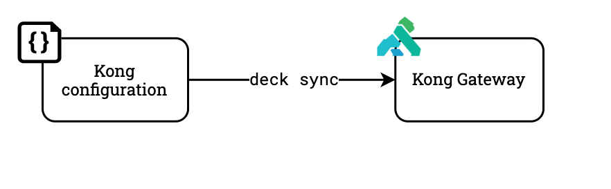

# Automating the Dev Pipeline to Rapidly Design, Publish, and Consume APIs with Kong

> This project assumes you are running in the [Kong Learning Lab
environment](https://education.konghq.com/courses/course-v1:kong+KGLL-107+Perpetual/course/).
Please reach out to your Kong Account Representative if you would like to access
the course material.

This repository provides a template for creating your own end-to-end [APIOps
workflow](https://konghq.com/blog/what-is-apiops) leveraging the [Kong API
Gateway](https://konghq.com/kong/), the world's most popular API gateway.
Following this workshop, you will:

- Using [Insomnia's](https://insomnia.rest/) `inso` CLI, convert an OpenAPI
  specification file into an equivalent Kong Gateway configuration format.
- Apply the configuration to the Gateway using Kong's declarative configuration
    tool [`decK`](https://docs.konghq.com/deck/overview/)
- Update the Developer Portal documentation using a single API call

Here is a diagram containing the full workflow:


This repository also includes sample Github Action runner scripts (under
`~/.github`) that can be used to initiate the full APIOps/GitOps workflow
out-of-the-box when running in Github.

## The APIOps Workflow

All automation is driven by two interactions within this repository: opening a
Pull Request (PR) or merging a commit to the `master` branch. Let's get started.

### 1. Generating the Configuration

The first step is to generate a Kong configuration from our OpenAPI
specification file using the `inso` CLI. The output of this step is a
declarative configuration that can be applied with `deck`.


To generate a declarative configuration, run:

```sh
inso generate config ./openapi/orders.yaml --type declarative -o kong.yaml
```

Feel free to inspect the `kong.yaml` file to see what the underlying
configuration looks like.

### 2. Validating the Configuration

The second step is to validate the configuration to ensure that it contains
valid syntax, and that it is ready to applied to a Kong Gateway. 

To validate our generated configuration file, run:

```sh
deck validate
```

### 3. Applying the Configuration

With our configuration generated with `kong.yaml`, we can now apply it to our
Kong instance using `deck`.



To apply the configuration with `deck`, run the commands below:

```sh
# BONUS: backup your current configuration - just to be safe
deck dump -o deck-backup.$(date +%s).yaml

# BONUS: review any changes prior to applying them
deck diff

# make it happen!
deck sync
```

> If you have RBAC enabled, then you'll want to add a `--headers
> "Kong-Admin-Token:yourtoken"` flag to the commands above in order to
> authenticate.

> If needed, you can scope your updates to a particular Kong workspace using the
> `--workspace` flag.

With the configuration successfully applied, you should see the changes take
place immediately. Try sending a request to any available routes for
verification.

### 4. Updating the documentation

With the runtime configuration in place, now it's time to update the API
documentation. This ensures that any consumer of our API has readily available,
up-to-date documentation.

To update the developer portal documentation for our service, run the following
command:

```sh
curl -XPUT localhost:8001/default/files/specs/httpbin.yaml --data contents=@openapi/orders.yaml
```

> The command above assumes you are updating the "default" workspace (noted by
> the `/default` URL prefix) with Kong running locally (noted by
> `localhost:8001`). You may need to update the command above to match your
> environment if you are running in a different environment.

In this example, we updated a single API in the Kong Developer Portal. While
this works for this use case, we could also have used the [`portal`
CLI](https://docs.konghq.com/enterprise/latest/developer-portal/helpers/cli/) to
update the entire developer documentation at once. If you or your team prefer
following a "GitOps" or "DocOps"-based workflow, the [`portal`
CLI](https://docs.konghq.com/enterprise/latest/developer-portal/helpers/cli/)
may provide a better alternative for updating your API documentation.

> [Insomnia](https://insomnia.rest/) also has built-in functionality for
> publishing APIs to your Kong developer portal using a graphical interface.

## Extras

### Enabling More Plugins

If you would like to include other plugins for your service, you can do so by
adding an `x-` extension to the API specification matching the plugin name and
configuration. 

For example, to configure the [rate limiting
plugin](https://docs.konghq.com/hub/kong-inc/rate-limiting/):

```yaml
x-kong-plugin-rate-limiting:
  enabled: true
  config:
    minute: 6
    limit_by: ip
    policy: local
```

The extension must start with `x-kong-plugin-` and then include the plugin name
in kebab-case format.

You can find a list of all available plugins in the Kong documentation
[here](https://docs.konghq.com/hub/).

## Questions?

Issues? Questions? Problems? Concerns? Don't hesitate to [reach
out](https://konghq.com/contact/).
